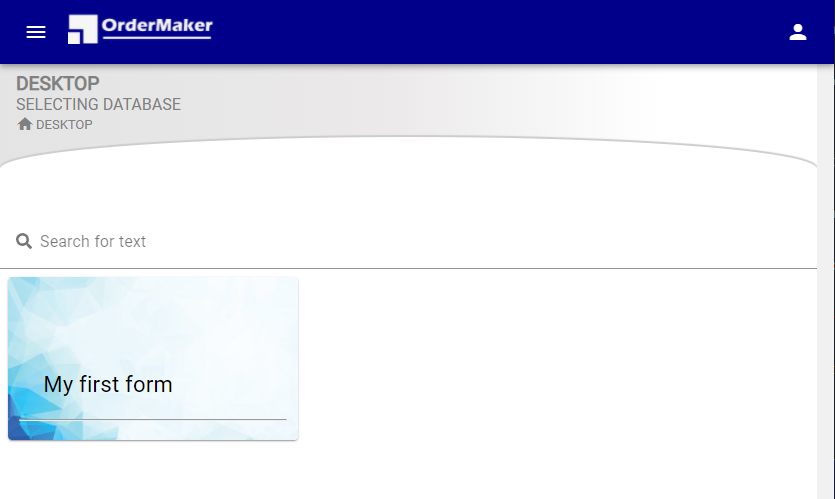



    

  
    
    

<strong>MTD OrderMaker</strong> is a simple web application that provides ability to make a knowledge base, query management system or any solutions based on forms and fields in a short time. 

MTD OrderMaker includes the Configurator module, provides administrators to create forms around which interaction functions automatically created — List (search and filtering), Editor, View and Print, and the ability to export data to Excel. Also, the user management module providers you to set the level of access rights for each user for each form. 

Read More: https://ordermaker.mtdkey.com/

## How to explore

Demo Server: https://demo.mtdkey.com/

1. Create a database using Demo Server 
2. Open the Configurator and Form Template Builder. 
3. Create a form, parts and fields.
4. Save changes.

After all this, you will open the Desktop menu item and see your first database.

      

## License

The MTD OrderMaker web application is free and open-source software and starting from version 2.0 is released under the MIT license. 

## Third-party integrations

List of vendors that are not in the [Dependency graph](https://github.com/olegbruev/OrderMakerServer/network/dependencies):

| Library               | Description                                            |
| --------------------- | ------------------------------------------------------ |
| [xdan]                | DateTimePicker jQuery plugin select date and time.     |
| [moment]              | A JavaScript date library for parsing, validating, manipulating, and formatting dates. |

[xdan]:https://github.com/xdan/datetimepicker
[moment]:https://github.com/moment/moment/
